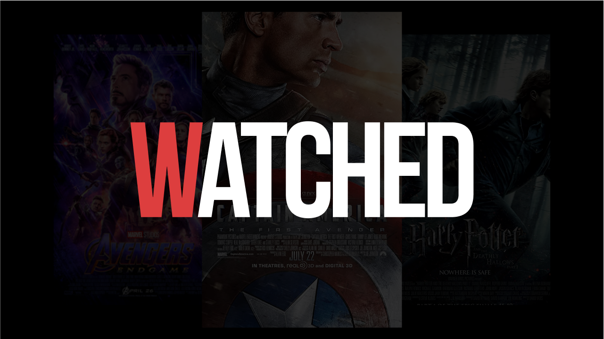
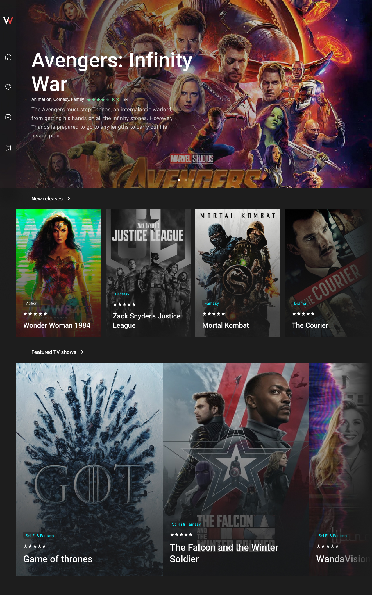
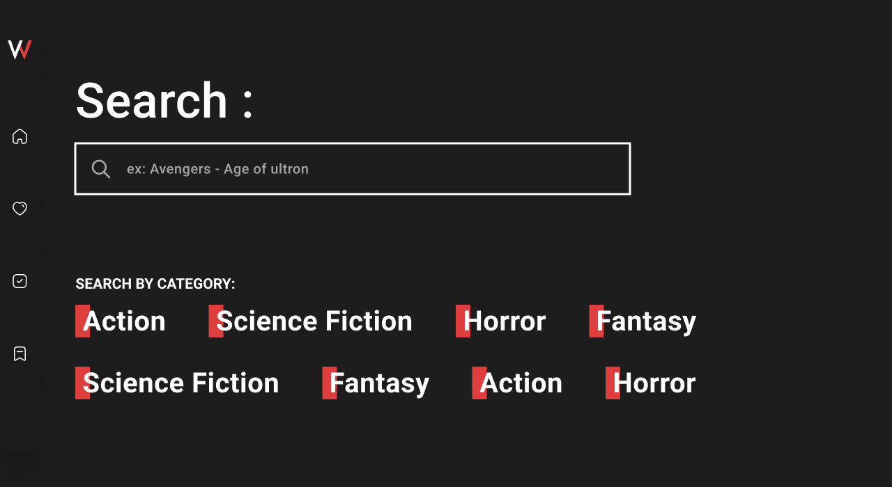
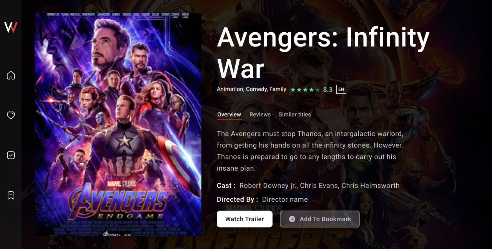

# Watched

Watched is a project I am working on, made by react, tailwindcss, [TMDB](www.themoviedb.org) api.
In this app, you can search a film, read a small breif about it, see te cast by their character in the film, add it to your wishlist if you have not watched it yet, or simply add it to your favourites.
I made this project because I love making react projects, and also to show my skills.

- [x] App design
- [x] Initialise react app
- [x] Writing some code
- [x] Writing some code
- [x] Debugging
- [x] Debugging
- [x] Debugging
- [x] Debugging
- [x] Axios discovered and start to work with it
- [x] Movies search page
- [x] Movie cast, crew members
- [x] Movie description, release date, rating, genre.
- [x] Movie simple age-based system that tell if a movie is suitable for children or not, will change later to a more specefic one(officially supported movie certifications on TMDB)
- [x] Add "add to favourites","add to wishlist" feature, using localStorage.
- [ ] "Select movies genre you like"
- [ ] Generating a graph based on user most movies genres he add to his favourites or he already selected.

_Component, scales, colors might be a bit different on the final product_
